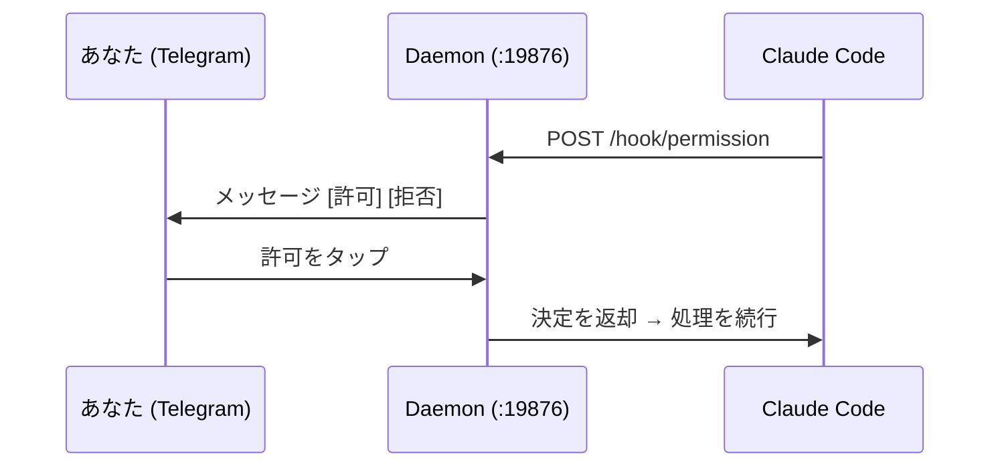

<div align="center">

# Claude Telegram Bridge

**スマホから Claude Code を操作。**

[](https://github.com/alan890104/claude-telegram-hook/releases)
[](../LICENSE)
[]()
[](https://core.telegram.org/bots/api)
[](https://www.rust-lang.org)

[English](../README.md) | [繁體中文](README.zh-TW.md) | [简体中文](README.zh-CN.md) | **[日本語](README.ja.md)** | [한국어](README.ko.md) | [Русский](README.ru.md)

</div>

---

Claude Code がツールの実行許可を求めるとき — シェルコマンドの実行やファイルの書き込みなど — **許可 / 拒否** ボタン付きの Telegram メッセージが届きます。ソファの上でも、カフェでも、別の部屋からでも、タップするだけ。ターミナルの前で待つ必要はありません。

Claude が質問したときやタスクが完了したときも通知が届きます。

## インストール

**macOS / Linux：**

```bash
curl -fsSL https://raw.githubusercontent.com/alan890104/claude-telegram-hook/main/scripts/install.sh | bash
```

**手動ダウンロード：** [Releases](https://github.com/alan890104/claude-telegram-hook/releases) からプラットフォームに合ったバイナリをダウンロード。

| プラットフォーム | ファイル |
|---|---|
| macOS (Apple Silicon) | `claude-telegram-bridge-darwin-arm64` |
| macOS (Intel) | `claude-telegram-bridge-darwin-amd64` |
| Linux x86_64 | `claude-telegram-bridge-linux-amd64` |
| Linux ARM64 | `claude-telegram-bridge-linux-arm64` |
| Windows x86_64 | `claude-telegram-bridge-windows-amd64.exe` |

<details>
<summary>ソースからビルド</summary>

```bash
cargo build --release
cp target/release/claude-telegram-bridge ~/.local/bin/
```
</details>

## はじめかた

**1. セットアップ** — Telegram bot を作成してリンク：

```bash
claude-telegram-bridge setup
```

ウィザードがすべて処理します：[@BotFather](https://t.me/BotFather) で bot 作成、chat ID 検出、タイムアウト設定、テストメッセージ送信。

**2. サービスのインストール** — バックグラウンドデーモンを登録し、Claude Code を設定：

```bash
claude-telegram-bridge install
```

完了。Claude Code を開けばそのまま使えます。

## 仕組み



単一のデーモンプロセスが Telegram 接続を独占。各 Claude Code セッションは localhost HTTP でデーモンと通信。ボタン押下はユニークなリクエスト ID で正しいセッションにルーティングされます。

**なぜデーモン？** 旧方式では hook 呼び出しごとに新プロセスが起動。複数の Claude Code セッションが Telegram の `getUpdates` を奪い合い、ボタンが機能しなくなりました。デーモン 1 つ、接続 1 つ、競合ゼロ。

## 設定ファイル

`~/.claude/hooks/telegram_config.json`

```json
{
  "bot_token": "123456:ABC-DEF...",
  "chat_id": "987654321",
  "permission_timeout": 300,
  "disabled": false,
  "daemon_port": 19876
}
```

| フィールド | デフォルト | 説明 |
|---|---|---|
| `bot_token` | — | Telegram Bot API トークン |
| `chat_id` | — | あなたの Telegram chat ID |
| `permission_timeout` | `300` | 自動拒否までの秒数 |
| `disabled` | `false` | アンインストールせずに一時停止 |
| `daemon_port` | `19876` | Hook ↔ デーモン通信のローカルポート |

環境変数フォールバック：`TELEGRAM_BOT_TOKEN`、`TELEGRAM_CHAT_ID`

## 動作一覧

| シナリオ | 結果 |
|---|---|
| **許可** をタップ | Claude Code が続行 |
| **拒否** をタップ | Claude Code にユーザーが拒否したと通知 |
| 応答なし（タイムアウト） | 許可は**拒否** — 安全なデフォルト |
| デーモン未起動 | Hook はサイレント終了、ターミナルプロンプトにフォールバック |
| 期限切れボタンを押下 | Telegram が「期限切れ」と表示 — 影響なし |
| 複数セッション | それぞれ独立したボタン、干渉なし |

## システムトレイ

- **緑** — 正常稼働中
- **オレンジ** — 保留中のリクエストあり
- メニュー：ステータス、保留数、設定ファイルを開く、終了

## トラブルシューティング

```bash
# デーモンの状態を確認
curl http://127.0.0.1:19876/health

# デバッグログで実行
RUST_LOG=debug claude-telegram-bridge daemon

# macOS：サービス再起動
launchctl unload ~/Library/LaunchAgents/com.claude-telegram-bridge.plist
launchctl load ~/Library/LaunchAgents/com.claude-telegram-bridge.plist
tail -f ~/Library/Logs/claude-telegram-bridge.log

# Linux：サービス再起動
systemctl --user restart claude-telegram-bridge
journalctl --user -u claude-telegram-bridge -f
```

## セキュリティ

- Hook 通信は `127.0.0.1` のみ — ネットワークに公開されません
- すべてのコールバックで Chat ID を検証
- UUID リクエスト ID で古いボタンのリプレイを防止
- すべての Telegram テキストは HTML エスケープ済み

## ライセンス

MIT
