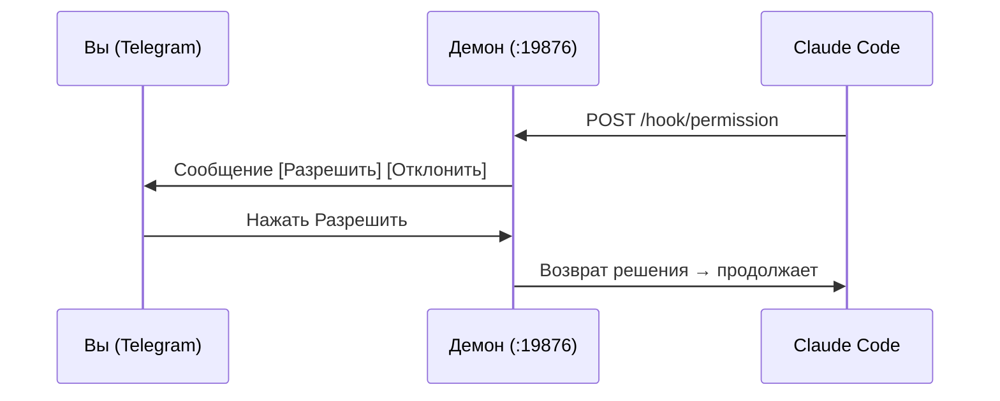

<div align="center">

# Claude Telegram Bridge

**Управляйте Claude Code с телефона.**

[](https://github.com/alan890104/claude-telegram-hook/releases)
[](../LICENSE)
[]()
[](https://core.telegram.org/bots/api)
[](https://www.rust-lang.org)

[English](../README.md) | [繁體中文](README.zh-TW.md) | [简体中文](README.zh-CN.md) | [日本語](README.ja.md) | [한국어](README.ko.md) | **[Русский](README.ru.md)**

</div>

---

Когда Claude Code запрашивает разрешение на выполнение инструмента — запуск shell-команды, запись файла и т.д. — вы получаете сообщение в Telegram с кнопками **Разрешить / Отклонить**. Нажмите с дивана, из кафе или из другой комнаты. Не нужно сидеть у терминала.

Вы также получаете уведомления, когда Claude задаёт вопрос или завершает задачу.

## Установка

**macOS / Linux:**

```bash
curl -fsSL https://raw.githubusercontent.com/alan890104/claude-telegram-hook/main/scripts/install.sh | bash
```

**Ручная загрузка:** скачайте бинарный файл для вашей платформы из [Releases](https://github.com/alan890104/claude-telegram-hook/releases).

| Платформа | Файл |
|---|---|
| macOS (Apple Silicon) | `claude-telegram-bridge-darwin-arm64` |
| macOS (Intel) | `claude-telegram-bridge-darwin-amd64` |
| Linux x86_64 | `claude-telegram-bridge-linux-amd64` |
| Linux ARM64 | `claude-telegram-bridge-linux-arm64` |
| Windows x86_64 | `claude-telegram-bridge-windows-amd64.exe` |

<details>
<summary>Сборка из исходного кода</summary>

```bash
cargo build --release
cp target/release/claude-telegram-bridge ~/.local/bin/
```
</details>

## Начало работы

**1. Настройка** — создайте Telegram-бота и свяжите:

```bash
claude-telegram-bridge setup
```

Мастер всё сделает: создание бота через [@BotFather](https://t.me/BotFather), определение chat ID, настройка таймаута, отправка тестового сообщения.

**2. Установка службы** — зарегистрируйте фоновый демон и настройте Claude Code:

```bash
claude-telegram-bridge install
```

Готово. Откройте Claude Code — всё работает.

## Как это работает



Один процесс-демон владеет соединением с Telegram. Каждая сессия Claude Code общается с демоном через localhost HTTP. Нажатия кнопок маршрутизируются к правильной сессии через уникальные ID запросов.

**Зачем демон?** Старый подход запускал новый процесс на каждый вызов хука. Несколько сессий Claude Code конкурировали за `getUpdates` Telegram, и кнопки переставали работать. Один демон, одно соединение, ноль конфликтов.

## Конфигурация

`~/.claude/hooks/telegram_config.json`

```json
{
  "bot_token": "123456:ABC-DEF...",
  "chat_id": "987654321",
  "permission_timeout": 300,
  "disabled": false,
  "daemon_port": 19876
}
```

| Поле | По умолчанию | Описание |
|---|---|---|
| `bot_token` | — | Токен Telegram Bot API |
| `chat_id` | — | Ваш Telegram chat ID |
| `permission_timeout` | `300` | Секунды до автоотклонения |
| `disabled` | `false` | Пауза без удаления |
| `daemon_port` | `19876` | Локальный порт для hook ↔ демон |

Переменные окружения: `TELEGRAM_BOT_TOKEN`, `TELEGRAM_CHAT_ID`

## Поведение

| Сценарий | Результат |
|---|---|
| Нажать **Разрешить** | Claude Code продолжает |
| Нажать **Отклонить** | Claude Code узнаёт, что пользователь отказал |
| Нет ответа (таймаут) | Разрешение **отклонено** — безопасное значение |
| Демон не запущен | Hook молча завершается, Claude переходит к терминалу |
| Нажата устаревшая кнопка | Telegram показывает «истёк» — без последствий |
| Несколько сессий | У каждой свои кнопки, без конфликтов |

## Системный трей

- **Зелёный** — работает нормально
- **Оранжевый** — есть ожидающие запросы
- Меню: статус, количество ожидающих, открыть конфиг, выход

## Устранение неполадок

```bash
# Проверить состояние демона
curl http://127.0.0.1:19876/health

# Запуск с отладочным логированием
RUST_LOG=debug claude-telegram-bridge daemon

# macOS: перезапуск службы
launchctl unload ~/Library/LaunchAgents/com.claude-telegram-bridge.plist
launchctl load ~/Library/LaunchAgents/com.claude-telegram-bridge.plist
tail -f ~/Library/Logs/claude-telegram-bridge.log

# Linux: перезапуск службы
systemctl --user restart claude-telegram-bridge
journalctl --user -u claude-telegram-bridge -f
```

## Безопасность

- Hook-трафик идёт только через `127.0.0.1` — не открыт в сеть
- Chat ID проверяется на каждом обратном вызове
- UUID-идентификаторы предотвращают повтор устаревших кнопок
- Весь текст в Telegram экранирован от HTML-инъекций

## Лицензия

MIT
