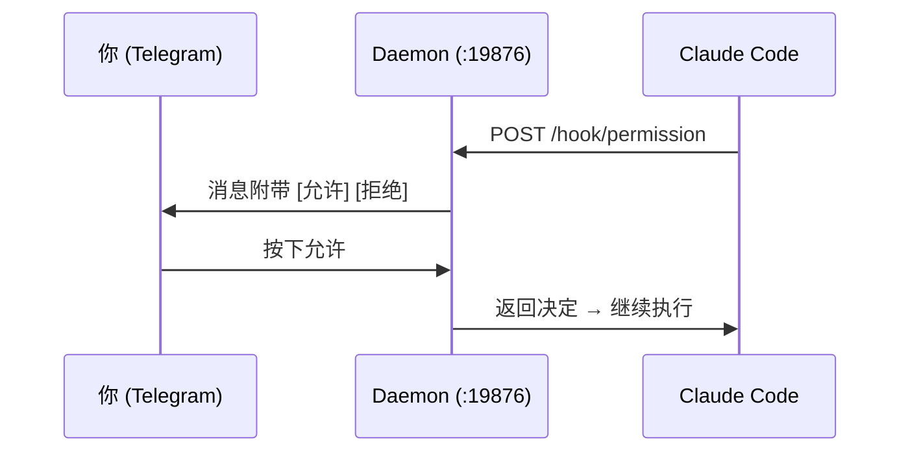

<div align="center">

# Claude Telegram Bridge

**用手机操控 Claude Code。**

[](https://github.com/alan890104/claude-telegram-hook/releases)
[](../LICENSE)
[]()
[](https://core.telegram.org/bots/api)
[](https://www.rust-lang.org)

[English](../README.md) | [繁體中文](README.zh-TW.md) | **[简体中文](README.zh-CN.md)** | [日本語](README.ja.md) | [한국어](README.ko.md) | [Русский](README.ru.md)

</div>

---

当 Claude Code 需要权限来执行工具 — 运行 shell 命令、写入文件等 — 你会收到一条带有 **允许 / 拒绝** 按钮的 Telegram 消息。在沙发上、咖啡店或另一个房间，点一下就行。不用守在终端前。

Claude 提问或完成任务时也会通知你。

## 安装

**macOS / Linux：**

```bash
curl -fsSL https://raw.githubusercontent.com/alan890104/claude-telegram-hook/main/scripts/install.sh | bash
```

**手动下载：** 到 [Releases](https://github.com/alan890104/claude-telegram-hook/releases) 下载对应平台的可执行文件。

| 平台 | 文件 |
|---|---|
| macOS (Apple Silicon) | `claude-telegram-bridge-darwin-arm64` |
| macOS (Intel) | `claude-telegram-bridge-darwin-amd64` |
| Linux x86_64 | `claude-telegram-bridge-linux-amd64` |
| Linux ARM64 | `claude-telegram-bridge-linux-arm64` |
| Windows x86_64 | `claude-telegram-bridge-windows-amd64.exe` |

<details>
<summary>从源码编译</summary>

```bash
cargo build --release
cp target/release/claude-telegram-bridge ~/.local/bin/
```
</details>

## 开始使用

**1. 设置** — 创建 Telegram bot 并关联：

```bash
claude-telegram-bridge setup
```

设置向导会处理一切：通过 [@BotFather](https://t.me/BotFather) 创建 bot、检测 chat ID、设置超时时间、发送测试消息。

**2. 安装服务** — 注册后台 daemon 并配置 Claude Code：

```bash
claude-telegram-bridge install
```

完成。打开 Claude Code 就能直接用了。

## 工作原理



单一 daemon 进程独占 Telegram 连接。每个 Claude Code session 通过 localhost HTTP 与 daemon 通信。按钮按下后通过唯一 request ID 路由到正确的 session。

**为什么需要 daemon？** 旧方案每次 hook 都启动新进程。多个 Claude Code session 同时存在时会抢夺 Telegram 的 `getUpdates`，导致按钮失效。一个 daemon、一条连接、零冲突。

## 配置文件

`~/.claude/hooks/telegram_config.json`

```json
{
  "bot_token": "123456:ABC-DEF...",
  "chat_id": "987654321",
  "permission_timeout": 300,
  "disabled": false,
  "daemon_port": 19876
}
```

| 字段 | 默认值 | 说明 |
|---|---|---|
| `bot_token` | — | Telegram Bot API token |
| `chat_id` | — | 你的 Telegram chat ID |
| `permission_timeout` | `300` | 自动拒绝前的等待秒数 |
| `disabled` | `false` | 暂停使用（无需卸载） |
| `daemon_port` | `19876` | Hook ↔ daemon 通信的本机端口 |

环境变量备选：`TELEGRAM_BOT_TOKEN`、`TELEGRAM_CHAT_ID`

## 行为一览

| 场景 | 结果 |
|---|---|
| 按下 **允许** | Claude Code 继续执行 |
| 按下 **拒绝** | Claude Code 被告知用户拒绝 |
| 没有响应（超时） | 权限**拒绝** — 安全默认 |
| Daemon 没在运行 | Hook 静默退出，Claude 回退到终端提示 |
| 按了过期按钮 | Telegram 显示"已过期" — 无影响 |
| 多个 session | 各自有独立按钮，互不干扰 |

## 系统托盘图标

- **绿色** — 正常运行
- **橙色** — 有待处理请求
- 菜单：状态、待处理数量、打开配置文件、退出

## 故障排查

```bash
# 检查 daemon 状态
curl http://127.0.0.1:19876/health

# 开启调试日志
RUST_LOG=debug claude-telegram-bridge daemon

# macOS：重启服务
launchctl unload ~/Library/LaunchAgents/com.claude-telegram-bridge.plist
launchctl load ~/Library/LaunchAgents/com.claude-telegram-bridge.plist
tail -f ~/Library/Logs/claude-telegram-bridge.log

# Linux：重启服务
systemctl --user restart claude-telegram-bridge
journalctl --user -u claude-telegram-bridge -f
```

## 安全性

- Hook 流量仅走 `127.0.0.1` — 不会暴露到网络
- 每个回调都验证 Chat ID
- UUID request ID 防止重放过期按钮
- 所有 Telegram 文本都经过 HTML 转义处理

## 许可证

MIT
