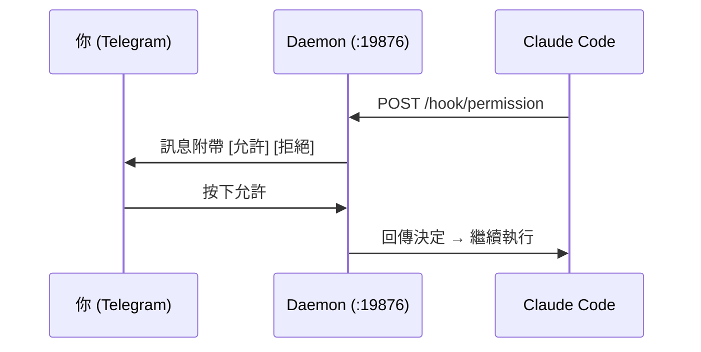

<div align="center">

# Claude Telegram Bridge

**用手機操控 Claude Code。**

[](https://github.com/alan890104/claude-telegram-hook/releases)
[](../LICENSE)
[]()
[](https://core.telegram.org/bots/api)
[](https://www.rust-lang.org)

[English](../README.md) | **[繁體中文](README.zh-TW.md)** | [简体中文](README.zh-CN.md) | [日本語](README.ja.md) | [한국어](README.ko.md) | [Русский](README.ru.md)

</div>

---

當 Claude Code 需要權限來執行工具 — 跑 shell 指令、寫入檔案等 — 你會收到一則帶有 **允許 / 拒絕** 按鈕的 Telegram 訊息。在沙發上、咖啡廳或另一個房間，點一下就好。不用守在終端機前。

Claude 提問或完成任務時也會通知你。

## 安裝

**macOS / Linux：**

```bash
curl -fsSL https://raw.githubusercontent.com/alan890104/claude-telegram-hook/main/scripts/install.sh | bash
```

**手動下載：** 到 [Releases](https://github.com/alan890104/claude-telegram-hook/releases) 下載對應平台的執行檔。

| 平台 | 檔案 |
|---|---|
| macOS (Apple Silicon) | `claude-telegram-bridge-darwin-arm64` |
| macOS (Intel) | `claude-telegram-bridge-darwin-amd64` |
| Linux x86_64 | `claude-telegram-bridge-linux-amd64` |
| Linux ARM64 | `claude-telegram-bridge-linux-arm64` |
| Windows x86_64 | `claude-telegram-bridge-windows-amd64.exe` |

<details>
<summary>從原始碼編譯</summary>

```bash
cargo build --release
cp target/release/claude-telegram-bridge ~/.local/bin/
```
</details>

## 開始使用

**1. 設定** — 建立 Telegram bot 並連結：

```bash
claude-telegram-bridge setup
```

設定精靈會處理一切：透過 [@BotFather](https://t.me/BotFather) 建立 bot、偵測 chat ID、設定逾時時間、發送測試訊息。

**2. 安裝服務** — 註冊背景 daemon 並設定 Claude Code：

```bash
claude-telegram-bridge install
```

完成。打開 Claude Code 就能直接使用。

## 運作原理



單一 daemon 程序獨佔 Telegram 連線。每個 Claude Code session 透過 localhost HTTP 與 daemon 溝通。按鈕按下後透過唯一 request ID 路由到正確的 session。

**為什麼需要 daemon？** 舊做法每次 hook 都啟動新 process。多個 Claude Code session 同時存在時會搶奪 Telegram 的 `getUpdates`，導致按鈕失效。一個 daemon、一條連線、零衝突。

## 設定檔

`~/.claude/hooks/telegram_config.json`

```json
{
  "bot_token": "123456:ABC-DEF...",
  "chat_id": "987654321",
  "permission_timeout": 300,
  "disabled": false,
  "daemon_port": 19876
}
```

| 欄位 | 預設值 | 說明 |
|---|---|---|
| `bot_token` | — | Telegram Bot API token |
| `chat_id` | — | 你的 Telegram chat ID |
| `permission_timeout` | `300` | 自動拒絕前的等待秒數 |
| `disabled` | `false` | 暫停使用（不需解除安裝） |
| `daemon_port` | `19876` | Hook ↔ daemon 通訊的本機 port |

環境變數備援：`TELEGRAM_BOT_TOKEN`、`TELEGRAM_CHAT_ID`

## 行為一覽

| 情境 | 結果 |
|---|---|
| 按下 **允許** | Claude Code 繼續執行 |
| 按下 **拒絕** | Claude Code 被告知使用者拒絕 |
| 沒有回應（逾時） | 權限**拒絕** — 安全預設 |
| Daemon 沒在跑 | Hook 靜默退出，Claude 回退到終端機提示 |
| 按了過期按鈕 | Telegram 顯示「已過期」— 無影響 |
| 多個 session | 各自有獨立按鈕，互不干擾 |

## 系統列圖示

- **綠色** — 正常運作
- **橘色** — 有待處理請求
- 選單：狀態、待處理數量、開啟設定檔、結束

## 疑難排解

```bash
# 檢查 daemon 狀態
curl http://127.0.0.1:19876/health

# 開啟除錯日誌
RUST_LOG=debug claude-telegram-bridge daemon

# macOS：重啟服務
launchctl unload ~/Library/LaunchAgents/com.claude-telegram-bridge.plist
launchctl load ~/Library/LaunchAgents/com.claude-telegram-bridge.plist
tail -f ~/Library/Logs/claude-telegram-bridge.log

# Linux：重啟服務
systemctl --user restart claude-telegram-bridge
journalctl --user -u claude-telegram-bridge -f
```

## 安全性

- Hook 流量僅走 `127.0.0.1` — 不會暴露到網路
- 每個 callback 都驗證 Chat ID
- UUID request ID 防止重放過期按鈕
- 所有 Telegram 文字都經過 HTML 跳脫處理

## 授權條款

MIT
